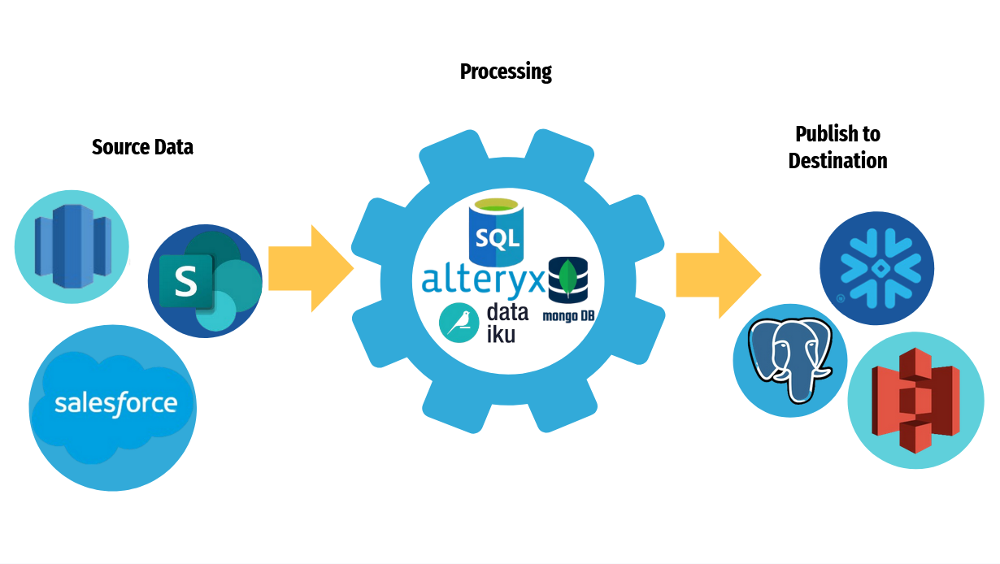

# ETL Pipelines: A Primer
### BU Data Science Association, Fall 2025

---
## Data Pipelines

**The Gist**: Get data from one place in one format to another place in another format
**ETL/ELT**: Extract, Transform, Load
**Pros**: Automates tasks, saves time + money, reduces troubleshooting
**Scalability**: Easy to scale with cloud resources, can use same data pipeline template for different tasks

---

---

# Apache Spark Overview

  

---

## Why use Spark? What is it?

- Per their Github: *A unified analytics engine for large-scale data processing”*
- Released in 2014
- Essentially, an extension of Pandas for massive distributed datasets  
- Open source and maintained by the Apache Software Foundation
- PySpark is the Python API for Apache Spark (the actual thing is written in Scala)  
- Scales ridiculously well so it works no matter the size of your data

---

## Batch vs Streaming

**Batch:** Process data every so often, all at once  
- Uses: Daily report generation, weekly payroll automation  
- *periodically complete high-volume, repetitive data jobs* (per AWS)

**Streaming:** Process data immediately when it comes in, often one row at a time  
- Examples: congestion pricing in NYC, Payment processing

*Spark does both, we'll focus on batch and simulate streaming*

---

## Spark vs SQL vs Pandas

  

---

## Spark vs SQL vs Pandas
<table style="width:100%; table-layout:fixed; font-size:small;">
  <tr>
    <td style="vertical-align:top; padding:5px; width:33%;">
      <strong>Spark</strong>
      <ul>
        <li>Built for distributed datasets that can't fit in memory</li>
        <li>Allows tables within tables</li>
      </ul>
    </td>
    <td style="vertical-align:top; padding:5px; width:33%;">
      <strong>SQL</strong>
      <ul>
        <li>Usually on one machine</li>
        <li>Highly structured relational database</li>
      </ul>
    </td>
    <td style="vertical-align:top; padding:5px; width:33%;">
      <strong>Pandas</strong>
      <ul>
        <li>Typically works in memory</li>
        <li>For small(ish) datasets</li>
        <li>Highly structured relational database</li>
      </ul>
    </td>
  </tr>
</table>

<em>All three have similar syntax</em>

---

## Databricks

- Originally, a jupyter notebook interface for running Apache Spark  
- Has expanded to have built-in SQL Warehouses, dashboards, job scheduler, bult-in AI features  
- They advertise this at hackathons a lot but we’re focusing on the original use case of Apache Spark/data analytics  
- So essentially a cloud platform for data science/analytics

---

## Parquet

- Dataframe storage format  
- Column-oriented compared to csv which is row-oriented  
- This is much better for working with massive amounts of data (imagine having to read in 50 different columns when you just want to join two of them)  
- Compressed (kind of like a zipped csv)

---

## Data Lakes

- Per Databricks: a *central location that holds a large amount of data in its native, raw format.*
- In practice, this is an S3 storage bucket  

S3: Amazon Simple Storage Service: cloud object storage where you can dump literally anything  
- Compared to a data warehouse which contains only more refined data, you can throw any kind of data into a data lake/S3 bucket  
- Used EVERYWHERE

  

---

## Delta Lake
- Storage format for data lakes  
- Made up of versioned Parquet files
- Commonly used with Apache Spark

---
